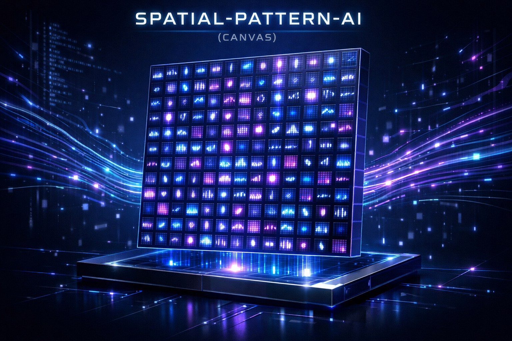
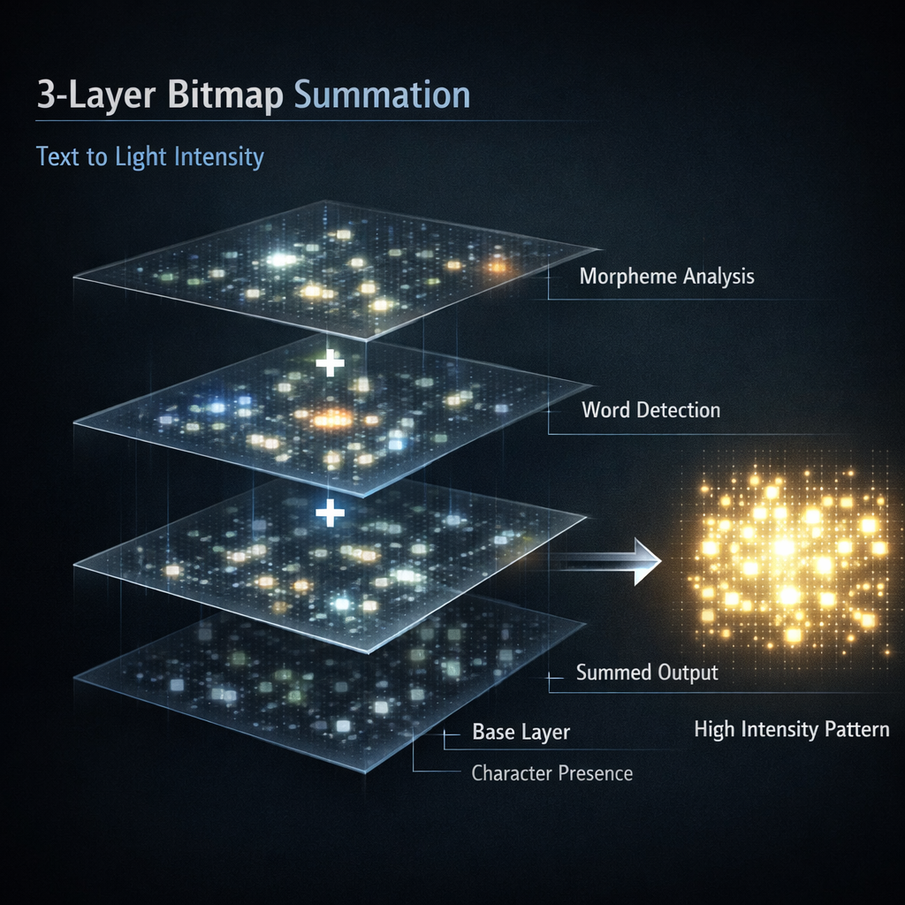
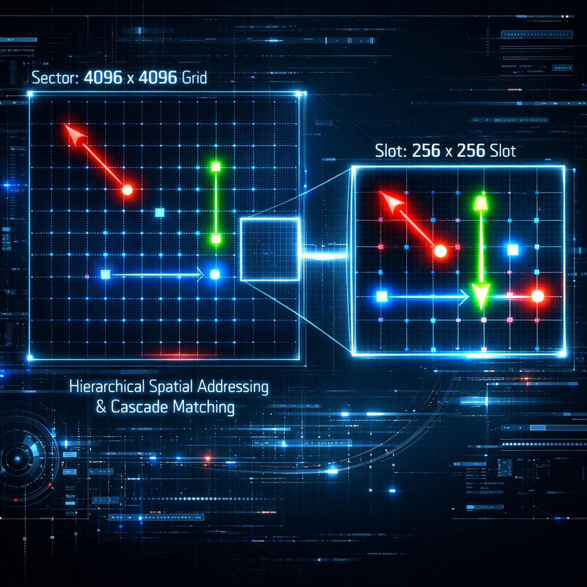

# CANVAS

### 공간 패턴 기반 AI 엔진



> 언어를 벡터가 아닌, 영상처럼 다룹니다.
> 메모리는 가중치 행렬이 아니라 한 장의 그림입니다.

---

## 핵심 아이디어

기존 LLM은 언어를 고정 크기의 가중치 행렬로 압축합니다.
지식을 추가하려면 재학습해야 하고, 메모리를 들여다볼 수는 없습니다. 불투명합니다.

**CANVAS는 그 반대입니다.**

텍스트는 2D 격자 위에 밝기 패턴으로 렌더링됩니다.
언어의 단위는 프레임이 되고, 프레임은 영상처럼 쌓입니다.
메모리는 행렬을 재학습하는 것이 아니라, 프레임을 덧붙여 자라납니다.

---

## 제공하는 것

| | |
|---|---|
| **무한 파라미터** | 새 입력은 새 프레임. 프레임은 상한 없이 누적됩니다. |
| **무한 컨텍스트** | RAM이 아닌 디스크 용량에 의해서만 제한됩니다. |
| **해석 가능성** | 엔진의 메모리는 시각적 패턴입니다. 무엇을 기억하는지 눈으로 확인할 수 있습니다. |
| **증분 학습** | 새 지식 = 한 장의 프레임. 재학습 없음. |
| **경량성** | 핵심 엔진은 스마트폰, 엣지 기기, 임베디드 하드웨어에서 동작합니다. |

---

## 시각적 개요



언어는 2D 격자 위의 패턴으로 인코딩됩니다.
비슷한 입력은 비슷한 패턴을, 다른 입력은 다른 패턴을 만듭니다.
엔진은 패턴 자체를 직접 비교합니다 — 임베딩도, 어텐션도 없이.



검색은 2단계 과정입니다: 빠른 조대 필터 → 정밀 매칭.
두 단계 모두 시각적 패턴 위에서 동작합니다.

---

## 왜 이게 중요한가

핵심 베팅은 이것입니다: **언어는 기호가 아니라 신호로 다루기에 충분한 공간적 구조를 갖는다.**

만약 이 베팅이 맞다면, 다음과 같은 AI 기반을 얻게 됩니다:

- 재학습 대신 사용하면서 성장함
- 컨텍스트를 잊지 않고 영원히 기억함
- 가중치 뒤에 숨지 않고 메모리를 보여줌
- 데이터 센터가 아닌 스마트폰에 들어감

---

## 기존 LLM과의 비교

```
                    기존 LLM                    CANVAS
  ──────────────────────────────────────────────────────────────
  표현 방식       토큰 → 벡터 → 행렬           격자 위의 패턴
  파라미터        고정 크기 행렬                무한 프레임 스택
  컨텍스트        제한된 윈도우                 디스크 용량 기반 (사실상 무제한)
  해석 가능성     불투명한 가중치               시각적 패턴
  학습 방식       전체 재학습 / 파인튜닝         증분: 프레임 1장
  설치 규모       데이터 센터 수준              임베디드 친화적
```

CANVAS는 생성형 LLM의 대체재가 아닙니다.
**기반(substrate)** 입니다 — 생성보다 패턴의 지속성이 더 중요한
검색 중심, 메모리 중심, 장기 컨텍스트 작업에 가장 적합합니다.

---

## 상태

- 코어 엔진: 동작하는 구현, 표준 코퍼스에서 벤치마크 완료
- 검색, 재현, 증분 메모리 태스크에서 검증됨
- 장기 컨텍스트 메모리 및 패턴 매칭 워크로드에 내부적으로 활용 중

**코어 엔진은 별도의 비공개 저장소에서 관리됩니다.**
이 저장소는 공개용 개요, 컨셉, 데모를 포함합니다.

---

## 활용 분야

- 에이전트를 위한 장기 컨텍스트 메모리
- 사용하면서 자라나는 검색 기반
- 증분 업데이트가 가능한 온디바이스 AI
- 해석 가능 / 시각적 AI 연구
- 재학습 없이 유지되는 도메인 특화 지식 저장소

---

## 라이선스

MIT — [LICENSE](LICENSE) 참조.

---

## 문의

- **GitHub:** https://github.com/sjpupro-lab/CANVAS-Engine
- **Team:** SJPU TEAM
- **Email:** sjpupro@gmail.com
- **문의:** https://github.com/sjpupro-lab/CANVAS-Engine/issues

협업, 라이선싱, 투자 문의는 위 채널을 통해 연락 바랍니다.
